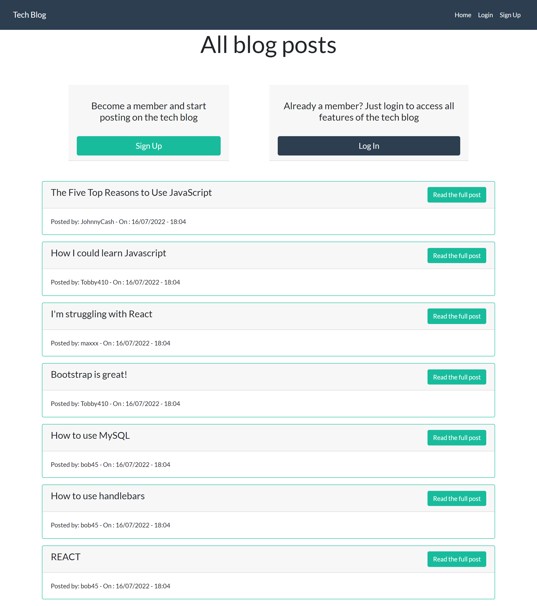
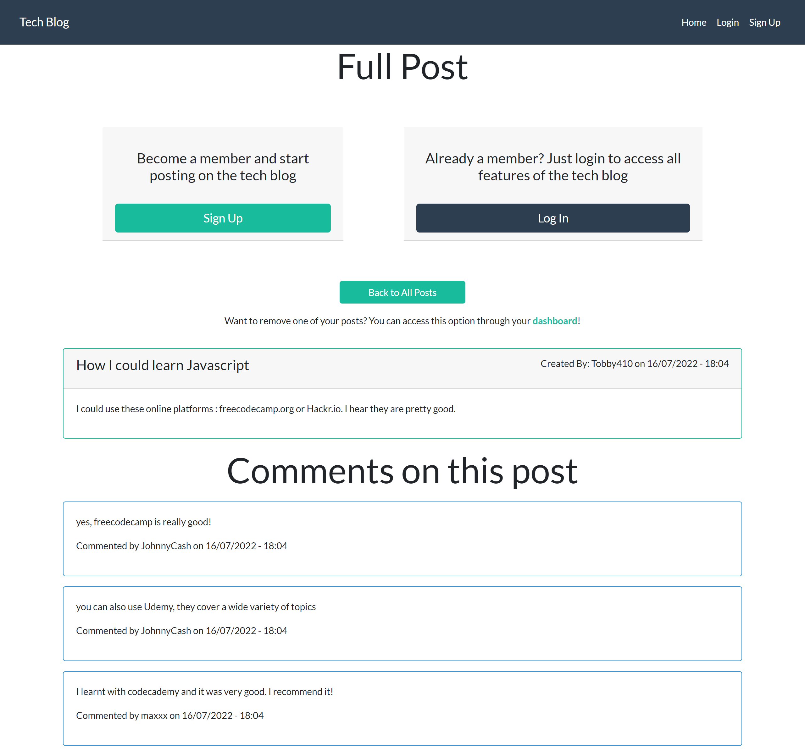
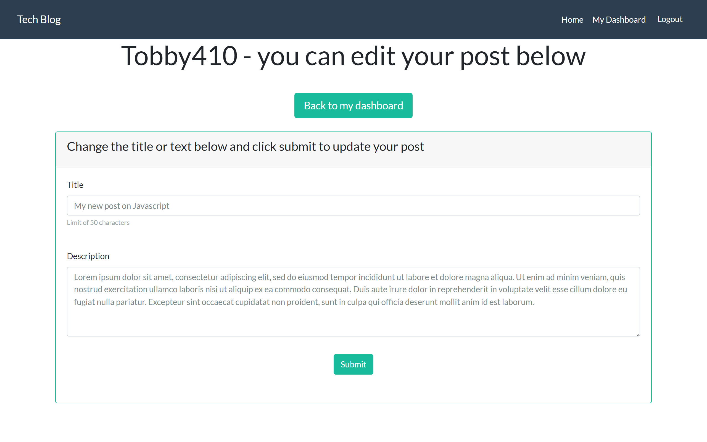
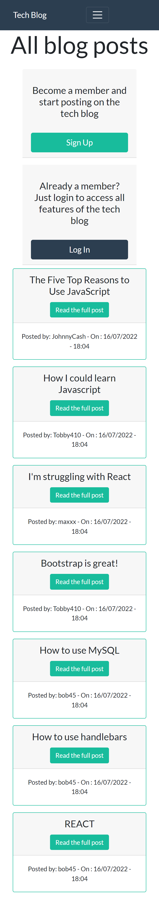

# Tech blog app


A tech blog app using node.js, express.js and handlebars for the frontend templating.

## Table of Content

- [Summary](#summary)
- [Screenshots of the application](#screenshots-of-the-application)
- [Detailed user story](#detailed-user-story)
- [Technologies](#technologies)
- [Routes](#routes)
- [Templating engine](#templating-engine)
- [Installation](#installation)
- [Contact](#contact)

## Summary

Github repo: [https://github.com/Am0031/tech-blog/tree/dev](https://github.com/Am0031/tech-blog/tree/dev)

Heroku deployed page: [https://]()

## Screenshots of the application

See below the different pages and views that the user will come across when using the app (desktop version) and a mobile version screenshot:

<details>
<summary>Home page - Desktop</summary>



</details>

<details>
<summary>Full post</summary>



</details>

<details>
<summary>Dashboard - My posts</summary>


</details>

<details>
<summary>Dashboard - My comments</summary>


</details>

<details>
<summary>Add post</summary>


</details>

<details>
<summary>Edit post</summary>



</details>

<details>
<summary>Delete comment</summary>


</details>

<details>
<summary>Home page - Mobile version</summary>



</details>

## Detailed User Story

### User Story

```md
AS A developer who writes about tech
I WANT a CMS-style blog site
SO THAT I can publish articles, blog posts, and my thoughts and opinions
```

### Acceptance Criteria

```md
GIVEN a CMS-style blog site
WHEN I visit the site for the first time
THEN I am presented with the homepage, which includes existing blog posts if any have been posted; navigation links for the homepage and the dashboard; and the option to log in
WHEN I click on the homepage option
THEN I am taken to the homepage
WHEN I click on any other links in the navigation
THEN I am prompted to either sign up or sign in
WHEN I choose to sign up
THEN I am prompted to create a username and password
WHEN I click on the sign-up button
THEN my user credentials are saved and I am logged into the site
WHEN I revisit the site at a later time and choose to sign in
THEN I am prompted to enter my username and password
WHEN I am signed in to the site
THEN I see navigation links for the homepage, the dashboard, and the option to log out
WHEN I click on the homepage option in the navigation
THEN I am taken to the homepage and presented with existing blog posts that include the post title and the date created
WHEN I click on an existing blog post
THEN I am presented with the post title, contents, post creator’s username, and date created for that post and have the option to leave a comment
WHEN I enter a comment and click on the submit button while signed in
THEN the comment is saved and the post is updated to display the comment, the comment creator’s username, and the date created
WHEN I click on the dashboard option in the navigation
THEN I am taken to the dashboard and presented with any blog posts I have already created and the option to add a new blog post
WHEN I click on the button to add a new blog post
THEN I am prompted to enter both a title and contents for my blog post
WHEN I click on the button to create a new blog post
THEN the title and contents of my post are saved and I am taken back to an updated dashboard with my new blog post
WHEN I click on one of my existing posts in the dashboard
THEN I am able to delete or update my post and taken back to an updated dashboard
WHEN I click on the logout option in the navigation
THEN I am signed out of the site
WHEN I am idle on the site for more than a set time
THEN I am able to view comments but I am prompted to log in again before I can add, update, or delete comments
```

## Technologies

For this project, the following technologies and packages were used:

- NPM & Node.js
- Express.js
- MySQL & Sequelize
- Express-session
- bcrypt
- handlebars.js
- JavaScript & jQuery
- Bootstrap

## Routes

On the back end, the application works with a MySQL database to store the posts and comments, and an express server to set up route to the DB.

The routes for this application are grouped into the 3 families:

- api: for interaction with the DB for the 4 CRUD operations
- views: for rendering the different pages (some of these include data retrieval from DB as well)
- auth: for authentication

## Templating engine

For this project, the templating engine **handlebars.js** has been used. It allows to set the views up so that they render parts of the template according to the session's status.

## Installation

To try out this application, you can visit this [heroku deployed app page]().

If you'd like to install this application locally on your machine, you will need to follow these steps for it to then run properly:

Open the CLI and clone the repository, using SSH keys:

```
git clone git@github.com:Am0031/tech-blog.git
```

Or using HTTPS link:

```
git clone https://github.com/Am0031/tech-blog.git
```

Go into the new repository and install the required packages:

```
cd tech-blog
npm install
```

Once installed, to get this project running, the following steps must be followed:

Step 1: Set the environment variables

In the root folder, create a .env file. Copy the content from the .env.sample file into your newly created .env file and complete each line as per the below guidance:

```
DB_HOST= (enter "localhost" or your host details)
DB_USER= (enter "root" or your user details)
DB_PASSWORD= (enter your mysql password)
DB_NAME= "techblog_db"
SESSION_SECRET= (enter a string of your choice for your session)
```

Step 2: Database setup

From the db folder, open an integrated terminal and enter the instructions below in this order, one line at a time, pressing enter after each line:

```
mysql -u root -p
(enter your password when prompted)

source schema.sql

quit
```

This will create the database. At this point, when checking in MySQL Workbench, you should see your database exists but is empty.

To seed information into this database, from the root folder, open an integrated terminal and enter the instruction below and press enter:

```
npm run seed
```

You can check your database in MySQL Workbench and should see information in all your tables.

Step 3: Start the application

Still in your integrated terminal, to run your server, enter the instruction below and press enter:

```
npm run start
```

Once the application is started, you can open your browser and travel to the localhost page with the following url: **http://localhost:4000/**

## Contact

If you have any questions about this application, feel free to get in touch by sending me an [email](mailto:amelie.pira@gmail.com).
